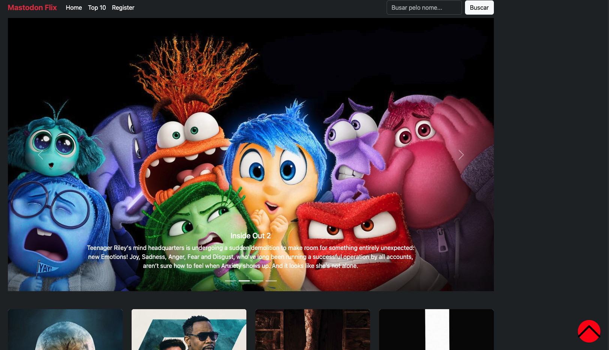
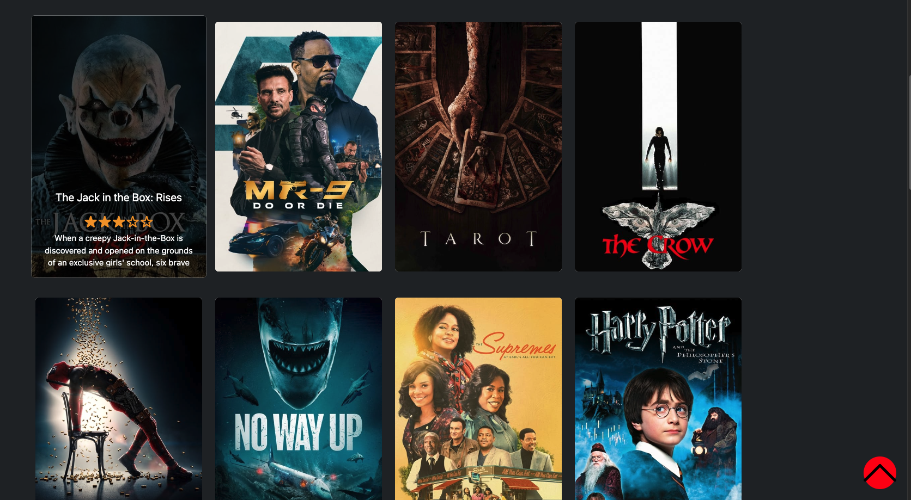
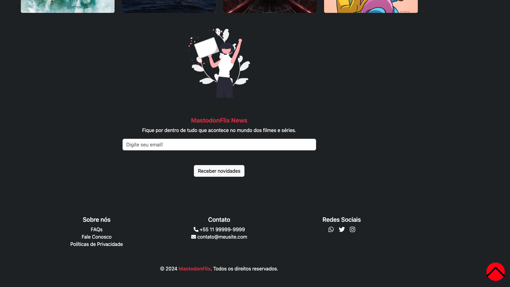
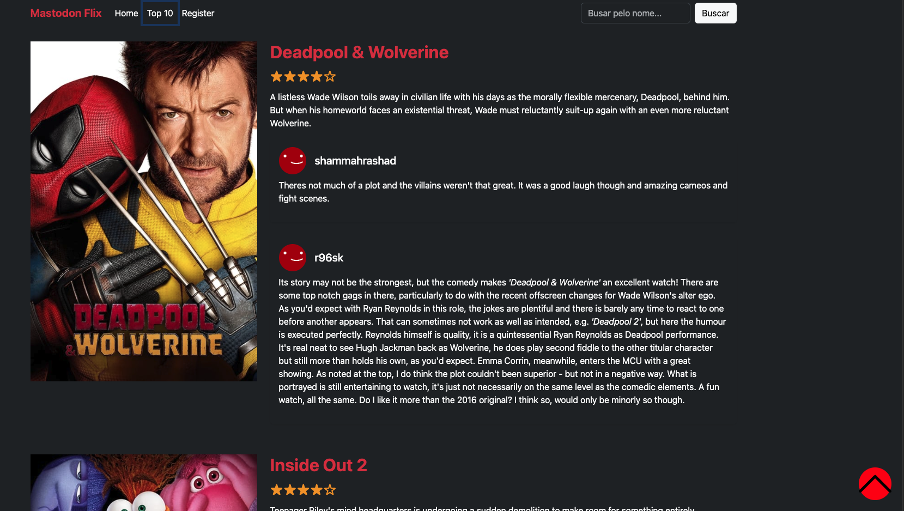
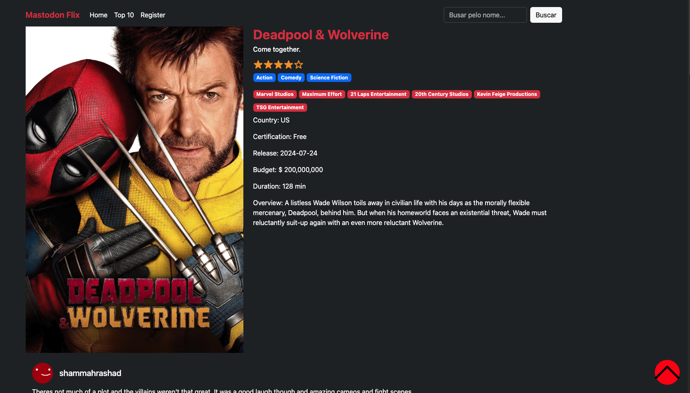

# VueMovies

## Project Overview
VueMovies is a project designed to reinforce your knowledge and skills in Vue.js and Vuex. The application consumes the TMDb (The Movie Database) API to fetch movie data and display it to users. This project provides a practical way to practice state management with Vuex while building a movie browsing application.

## Project Setup

### Install Dependencies
To get started, install the necessary dependencies by running the following command:

```bash
yarn install && npm run serve
```
```bash
npm  install && npm run serve
```

### .ENV configuration

```
VUE_APP_TITLE=
NODE_ENV=
VUE_APP_MOVIE_URL_API=
VUE_APP_MOVIE_API_KEY=
```





